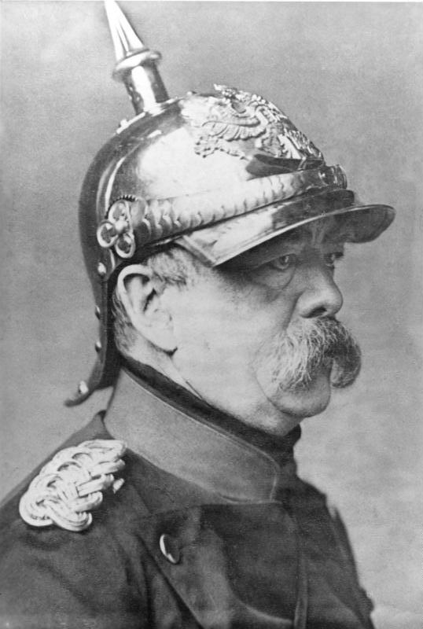

# Industrialisierung und die Entstehung des Sozialstaates

- Das 19. Jahrhundert im Fokus
- Die "Soziale Frage"
- Der Weg zu unseren heutigen Sozialleistungen

::: notes
Herzlich willkommen! Wir schauen uns heute das 19. Jahrhundert und die "Soziale Frage" an. Vieles, was für uns heute selbstverständlich ist - wie die Kranken- oder Rentenversicherung -, hat seinen Ursprung in dieser Zeit. Ich zeige euch, wie aus der harten Industrialisierung unser Sozialstaat entstand und welche Rolle Karl Marx und Otto von Bismarck dabei spielten.
:::

# Die Industrielle Revolution auf Hochtouren

- Start Ende des 18. Jahrhunderts (England)
- Mitte des 19. Jahrhunderts: Boom in Deutschland
- Vom Agrarstaat zum Industriestaat
- Treiber: Erfindungen wie die Dampfmaschine (James Watt)

::: notes
Die Revolution begann Ende des 18. Jahrhunderts in England und erreichte um 1850 Deutschland. Dank Erfindungen wie der Dampfmaschine wandelte sich die Gesellschaft rasant vom Agrar- zum Industriestaat. Die Folge: Menschen zogen massenhaft vom Land in die Städte, um in den neuen, riesigen Fabriken zu arbeiten.
:::

# Das Elend der Arbeiterschaft

- Harte und gefährliche Arbeit
- Arbeitstage von mehr als 12 Stunden
- Hungerlöhne und Kinderarbeit
- Starke Konkurrenz unter den Arbeitern

::: notes
Dieser Boom hatte einen hohen Preis. Die Arbeiter schufteten unter katastrophalen Bedingungen: 12-Stunden-Tage, Hungerlöhne und Kinderarbeit waren Alltag. Es gab kaum Sicherheit, Unfälle waren häufig. Da es mehr Arbeiter als Stellen gab, war jeder Einzelne austauschbar und musste sich den harten Bedingungen fügen.
:::

# Die Analyse von Karl Marx

- Karl Marx (1818 - 1883): Philosoph und scharfer Kritiker
- **Bourgeoisie:** Reiches Bürgertum, besitzt die Produktionsmittel
- **Proletarier:** Arbeiter, besitzen nur ihre eigene Arbeitskraft
- Ungleiches Machtverhältnis

::: notes
Ein scharfer Kritiker dieser Zustände war Karl Marx. Er sah eine gespaltene Gesellschaft: Die "Bourgeoisie" (Fabrikbesitzer) besass die Produktionsmittel wie Maschinen und Rohstoffe. Demgegenüber stand das "Proletariat" (Arbeiter), das nur seine eigene Arbeitskraft besass und damit komplett von den Unternehmern abhängig war.
:::

# Der Weg in den Kommunismus

- Grundwiderspruch des Kapitalismus: Arbeiter schaffen Reichtum, Unternehmer kassieren ab
- Ziel: Produktionsmittel in Gesellschaftseigentum umwandeln
- Kapitalismus -> Sozialismus -> Kommunismus (klassenlose Gesellschaft)
- "Proletarier aller Länder, vereinigt euch!" (1848)

::: notes
Marx sah darin den Grundwiderspruch des Kapitalismus: Arbeiter schaffen den Reichtum, aber nur Unternehmer kassieren ab. Sein Ziel war die Überführung der Fabriken in Gesellschaftseigentum. Über den Sozialismus sollte die klassenlose Gesellschaft entstehen: der Kommunismus. 1848 rief er im Manifest auf: "Proletarier aller Länder, vereinigt euch!"
:::

# Aufstand und Nationalparlament

- 1847: Hungersnot durch Missernten
- 1848: Strassenkämpfe in Berlin und Frankfurt
- Das erste Nationalparlament in der Frankfurter Paulskirche
- Ergebnis: Erste Grundrechte, aber letztliches Scheitern der Revolution

::: notes
1847 führten Missernten zu Hungersnöten, was 1848 zur Märzrevolution entlud. In der Frankfurter Paulskirche tagte das erste Nationalparlament und formulierte Grundrechte wie die Pressefreiheit. Letztlich scheiterte die Revolution jedoch am internen Streit und dem Militär der Monarchen, die die alte Ordnung wiederherstellten.
:::

# Gemeinsam stark: Arbeiter schliessen sich zusammen

- Erkenntnis: Gleiche Forderungen, gemeinsam mehr Macht
- Zusammenschluss nach Berufszweigen (z.B. Drucker, Zigarrenarbeiter)
- Forderungen: Soziale Absicherung, 10-Stunden-Tag
- Druckmittel: Der Streik

::: notes
Trotz des Scheiterns der Revolution lernten die Arbeiter: In der Masse liegt die Kraft. Sie organisierten sich in Berufsverbänden und Gewerkschaften. Sie forderten soziale Absicherung und den 10-Stunden-Tag. Um Druck auf die Unternehmer auszuüben, nutzten sie kollektive Arbeitsverweigerung - den Streik.
:::

# Eine eigene politische Stimme

- 1875: Gründung der Sozialistischen Arbeiterpartei Deutschlands (SAP)
- Vorläufer der heutigen SPD
- Gewerkschaften und Politiker kämpfen gemeinsam für Rechte

::: notes
Der Widerstand wurde politisch: 1875 gründete sich die Sozialistische Arbeiterpartei Deutschlands (SAP), der Vorläufer der heutigen SPD. Damit konnten Gewerkschaften und Politiker nun gemeinsam im Parlament für die Rechte der Arbeiterschaft kämpfen.
:::

# Das Sozialistengesetz

- Reichskanzler Otto von Bismarck sieht die SAP als Gefahr
- 1878: Attentate auf Kaiser Wilhelm I. als Vorwand
- "Sozialistengesetz": Verbot sozialistischer Parteien und Versammlungen (Peitsche)
- Die Folge: Arbeiter schliessen sich noch stärker zusammen

::: notes
Reichskanzler Bismarck sah die SAP als Gefahr und reagierte mit "Zuckerbrot und Peitsche". Die "Peitsche" war das Sozialistengesetz von 1878, das sozialistische Organisationen verbot. Doch das Gesetz bewirkte das Gegenteil: Der Zusammenhalt der Arbeiter wuchs, und die Opposition wurde bei Wahlen immer stärker.
:::

# Der Grundstein des Sozialstaates

- Bismarcks "Zuckerbrot": Den Arbeitern entgegenkommen
- 1883: Einführung von Sozialversicherungen
- Kranken-, Unfall- und Rentenversicherung
- Fazit: Aus dem Elend entstand das Fundament unseres heutigen Systems

::: notes
Schliesslich folgte das "Zuckerbrot": Um die Arbeiter an den Staat zu binden und eine Revolution zu verhindern, führte Bismarck ab 1883 die Kranken-, Unfall- und Rentenversicherung ein. Dies war das Fundament unseres heutigen Sozialstaates. Marx' Analysen und Bismarcks Reformen prägen unsere Arbeitswelt bis heute. Vielen Dank!
:::
