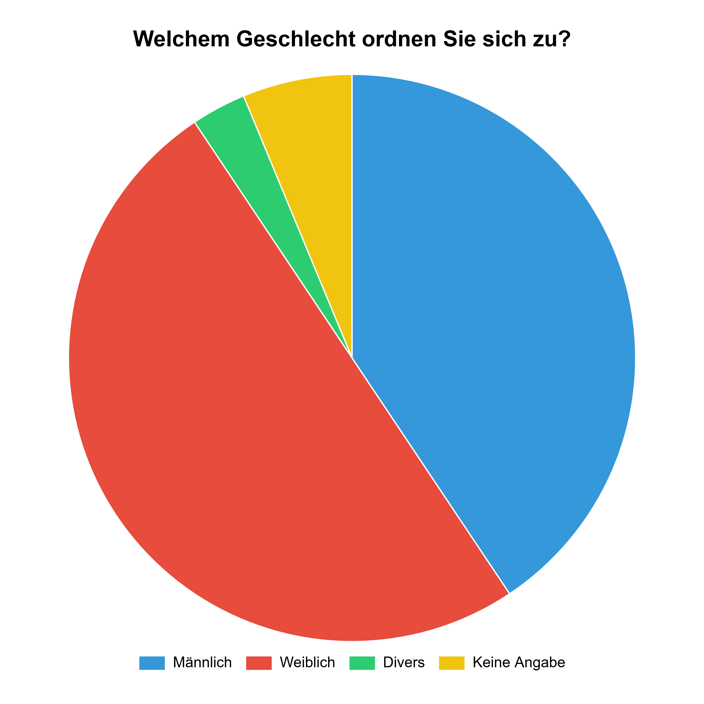
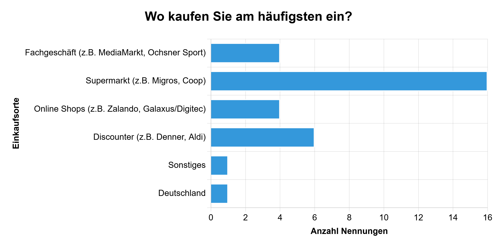

# Umfragebericht: Konsumverhalten junger Menschen

## 1. Einleitung

Im Rahmen meines ABU-Unterrichts habe ich eine Umfrage zum Thema Konsumverhalten durchgeführt. Ich wollte herausfinden, wie Jugendliche und junge Erwachsene im Alter zwischen 16 und 26 Jahren beim Einkaufen entscheiden. In meiner Umfrage habe ich den Fokus auf die Relevanz der Nachhaltigkeit gesetzt und untersucht, ob diese noch eine Rolle spielt, oder zählen am Ende nur noch Preis und Marke? Insgesamt haben 31 Personen teilgenommen. Diese Antworten bilden die Grundlage für den vorliegenden Bericht.

## 2. Auswertung und Analyse

In folgendem Abschnitt werte ich die Antworten der durchgeführten Umfrage aus. Die Umfrage wurde via Microsoft Forms durchgeführt.

### 2.1 Demografie der Befragten

Die erste Grafik zeigt das Alter der Teilnehmer. Die Gruppe ist zwischen 16 und 26 Jahren alt, mit einem Durchschnittsalter von 19,7 Jahren. Damit deckt die Umfrage genau die Zielgruppe ab, die ich untersuchen wollte: Jugendliche und junge Erwachsene, die teilweise schon ein eigenes Einkommen haben. In diesem Lebensabschnitt verändert sich das Konsumverhalten stark, da sich finanzielle Verantwortung ausprägt.

Dieses Kreisdiagramm zeigt die Geschlechter-verteilung. Daran ist abzuleiten, dass deutlich mehr Frauen als Männer teilnahmen. Ein geringer Teil definiert sich als divers oder möchte keine Angabe machen. Aufgrund der höheren Frauenquote könnten die Ergebnisse der Nachhaltigkeitsthemen leicht beeinflusst sein, da Frauen in Umfragen statistisch oft angeben, stärker auf die Umwelt zu achten. Man könnte daraus interpretieren, dass Frauen Nachhaltigkeit relevanter sehen als Männer.

### 2.2 Wo und wie wird eingekauft?

Hier sieht man deutlich, dass der Supermarkt der beliebteste Ort zum Einkaufen ist. Danach folgen Online-Shops und Discounter. Obwohl heute sehr viel im Internet bestellt wird, gehen Jugendliche für ihre täglichen Besorgungen am liebsten direkt in einen Laden, was wohl an der sofortigen Verfügbarkeit liegt.

Bei dieser Frage waren Mehrfachantworten möglich. Das Ergebnis zeigt klar, dass Preis und Qualität die wichtigsten Gründe für einen Kauf sind. Nachhaltigkeit und der Markenname liegen deutlich dahinter. Junge Menschen achten zwar auf Qualität, aber schlussendlich muss es günstig sein. Die Umwelt kommt oft erst an zweiter Stelle, insbesondere bei knappem Budget.

### 2.3 Die Rolle der Nachhaltigkeit

Die meisten Befragten gaben an, dass sie "teils / teils" oder "eher nicht" auf Nachhaltigkeit achten. Nur wenige achten voll und ganz darauf. Hier sieht man einen klaren Unterschied zwischen Realität und Behauptungen in Medien.

Den Befragten, denen Nachhaltigkeit wichtig ist, stehen insbesondere faire Produktion und Regionalität im Vordergrund. Die Herkunft und faire Arbeitsbedingungen sind den Jugendlichen wichtiger als beispielsweise eine umweltfreundliche Verpackung.

## 3. Fazit

Die Umfrage zeigt ein klares Bild: Die meisten Jugendlichen kennen die Relevanz von Nachhaltigkeit, entscheiden sich beim Einkaufen aber oft für die optimaleren Preis-Leistungsverhältnisse. Nachhaltigkeit wird häufig aufgrund der höheren Kosten in den Hintergrund geschoben. Wenn nachhaltige Produkte preislich attraktiver wären, würde sich der Kaufanteil bei Jugendlichen wahrscheinlich erhöhen. Die Umfrage war für mich sehr lehrreich und gibt mir einen guten Einblick in die Meinung meiner Generation.
