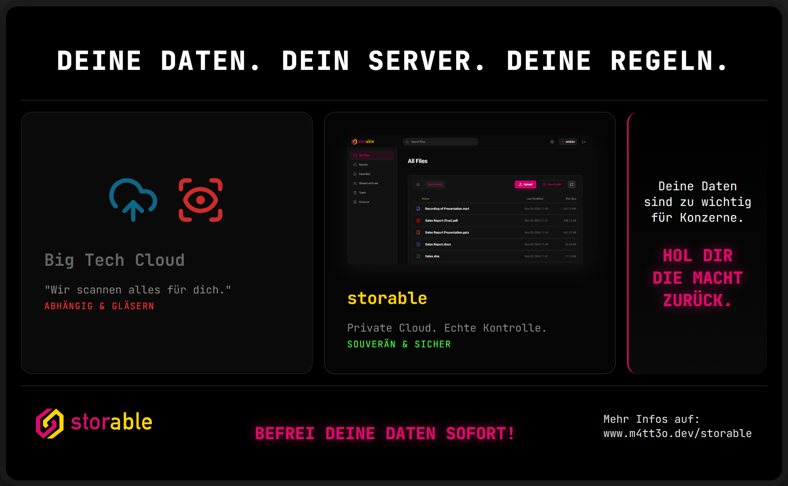

# Projektdokumentation: storable - Deine Daten. Dein Server. Deine Regeln.

## 1. Das Kreativ-Produkt: Werbeplakat

**Konzept & Visuelle Umsetzung**
Das gestaltete Werbeplakat arbeitet mit einem starken visuellen und inhaltlichen Kontrast, um die Kernbotschaft der Software **storable** zu transportieren. Das Design nutzt eine moderne, dunkle Ästhetik (Dark Mode), die an eine technisch versierte Zielgruppe appelliert. Die Bildsprache ist in drei klare Sektionen unterteilt:

- **Links (Das Problem):** Die "Big Tech Cloud" wird durch ein Wolken-Symbol gepaart mit einem markanten roten Auge (Scanning-Symbol) dargestellt. Die Signal- und Warnfarbe Rot beim Text "ABHÄNGIG & GLÄSERN" unterstreicht die Gefahr und das Unbehagen der ständigen Überwachung.
- **Mitte (Die Lösung):** Das Zentrum bildet ein sauberer, aufgeräumter Screenshot der **storable**-Benutzeroberfläche. Er beweist die Reife und Nutzbarkeit des Produkts. Die grüne Schriftfolge "SOUVERÄN & SICHER" signalisiert psychologisch freie Fahrt, Vertrauen und Schutz.
- **Rechts (Die Motivation):** Ein starker typografischer Block in leuchtendem Pink holt den Betrachter emotional ab und fordert zur Handlung auf ("HOL DIR DIE MACHT ZURÜCK.").

**Wirkungsbeschreibung**
Das Plakat nutzt gezielt den Kontrast zwischen Angst (Kontrollverlust durch Konzerne) und Erleichterung (digitale Selbstbestimmung). Die dunkle Hintergrundgestaltung lässt die farbigen Akzente (Rot für Gefahr, Grün für Sicherheit, Pink für Aktion) stark hervortreten und lenkt den Blick des Betrachters logisch von links nach rechts - vom Problem zur Lösung bis hin zum Call-to-Action. Das **storable**-Logo und das UI-Mockup in der Mitte fungieren dabei als Ankerpunkt für Vertrauen. Die rahmenden Slogans oben und unten fassen die Philosophie prägnant zusammen und vermitteln dem Nutzer das Gefühl ultimativer Souveränität über die eigenen digitalen Güter.

## 2. Die Heldenreise-Map

Um die Geschichte von **storable** greifbar zu machen, wurde die narrative Struktur der klassischen Heldenreise auf die Customer Journey angewendet:

- **Der Held (Unsere Zielgruppe):** Unser Held ist der "souveräne Digitalist". Es handelt sich um technisch interessierte, datenschutzbewusste Menschen, die sich im goldenen Käfig der grossen Tech-Konzerne gefangen und unfrei fühlen. Ihr "Ruf zum Abenteuer" ist die zunehmende Einschränkung der Privatsphäre und der tiefe Wunsch nach digitaler Autonomie.
- **Der Mentor (Die Produkt-Einführung):** In unserer Geschichte übernimmt das Open-Source-Ethos in Form der Software **storable** die Rolle des Mentors. **storable** tritt nicht als herrschsüchtiger Dienstleister auf, sondern als mächtiges Werkzeug. Der Mentor zeigt dem Helden den Weg und reicht ihm das metaphorische Schwert: _"Du besitzt bereits die Hardware - ich gebe dir das Werkzeug, um die Macht darüber zurückzuerlangen."_
- **Das Elixier (Der Endzustand):** Das Elixier ist die "digitale Unantastbarkeit". Am Ende der Reise kehrt der Held mit dem beruhigenden Wissen in seinen Alltag zurück, dass seine sensibelsten Daten, privaten Fotos und Dokumente physisch in seinen eigenen vier Wänden liegen. Dieser Endzustand ist geprägt von tiefer Sicherheit, Erleichterung und einem ausgeprägten Stolz auf die eigene digitale Unabhängigkeit.

## 3. Die Kommunikations-Analyse (nach Friedemann Schulz von Thun)

Das Plakat bedient alle vier Seiten einer Nachricht, fokussiert sich in seiner strategischen Ausrichtung jedoch stark auf das Appell-Ohr und die Selbstkundgabe.

- **Appell (Wozu ich dich veranlassen möchte):**
  Dies ist die primäre Ebene unserer Kommunikation. Mit direkten Handlungsaufforderungen wie _"Hol dir die Macht zurück."_ und _"Befrei deine Daten sofort!"_ fordern wir den Kunden aktiv auf, sein Verhalten zu ändern, die Big-Tech-Bequemlichkeit zu verlassen und selbst Verantwortung zu übernehmen.
- **Selbstkundgabe (Was ich von mir offenbare):**
  Wir präsentieren uns als idealistisches, transparentes Projekt. Die Botschaft signalisiert: Uns ist Privatsphäre wichtiger als Profit. Wir verstehen die technischen und ethischen Bedenken der Community, weil wir _"einer von euch"_ sind.
- **Beziehungsebene (Was ich von dir halte und wie wir zueinander stehen):**
  Die Kommunikation findet strikt auf Augenhöhe statt. Wir behandeln den Nutzer nicht als unbedarften Konsumenten, sondern als mündigen Partner. Wir sind kein herablassender Dienstleister, sondern bieten "Hilfe zur Selbsthilfe". Das Duzen ("Deine Daten", "Hol dir...") schafft ein solidarisches Wir-Gefühl gegen die anonymen Grosskonzerne.
- **Sachinhalt (Worüber ich informiere):**
  Die sachliche Information lautet: **storable** ist eine Private-Cloud-Lösung, die es ermöglicht, Dateien auf eigenen Servern zu hosten und zu verwalten (belegt durch den UI-Screenshot).
