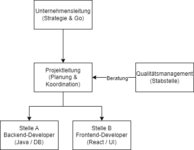
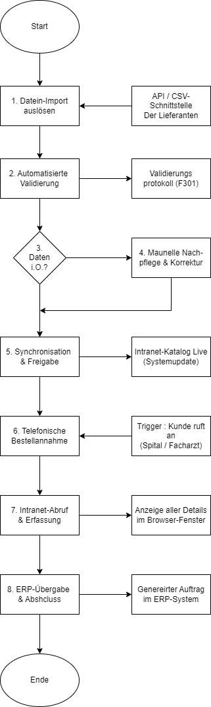
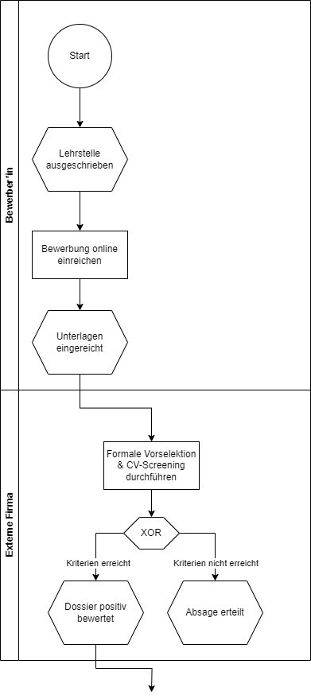
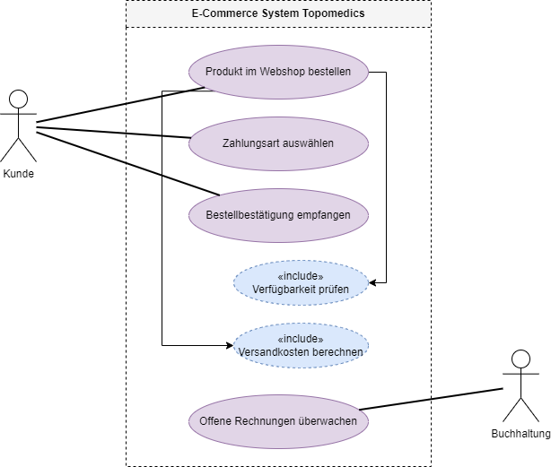
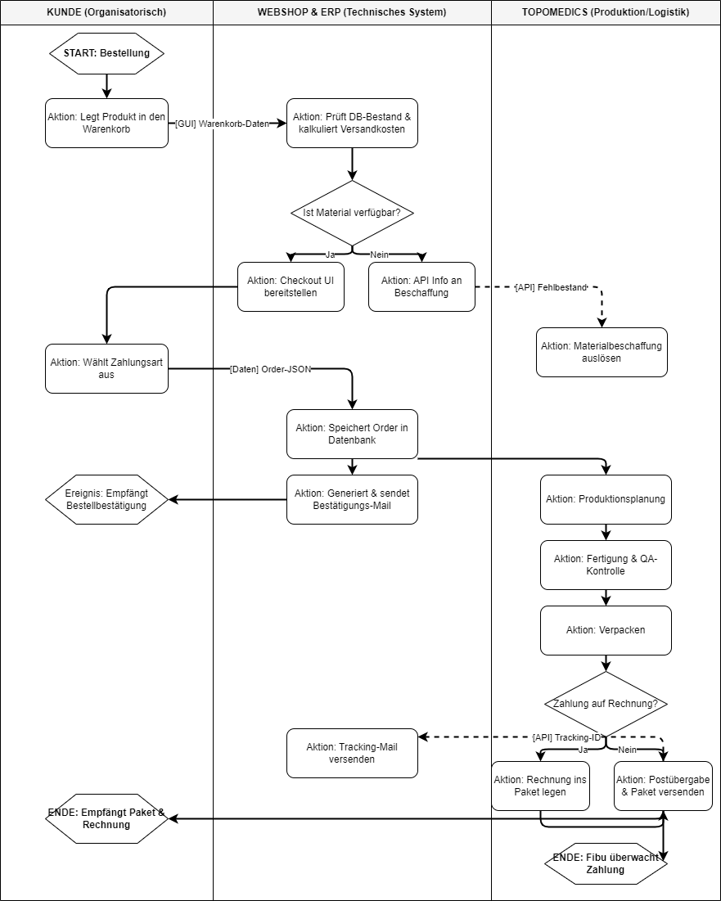

# Präsentation Modul 254: Geschäftsprozesse beschreiben

**Ziel-Dauer:** 8 Minuten
**Fokus:** Zusammenfassung der erarbeiteten Gesamtdokumentation (TimeTrack Pro & Topomedics AG)

## Folie 1: Titelfolie (0.5 Min)

**Titel:** Modul 254: Geschäftsprozesse beschreiben
**Untertitel:** Zusammenfassung der Projektdokumentation (TimeTrack Pro & Topomedics AG)
**Name:** Matteo Bosshard

**Sprechtext:**
"Guten Tag zusammen und herzlich willkommen zu meiner Abschlusspräsentation für das Modul 254. Ich werde euch in den nächsten acht Minuten eine Zusammenfassung meiner Gesamtdokumentation präsentieren. Darin zeige ich auf, wie ich die theoretischen Konzepte der Prozess- und Betriebsorganisation praktisch angewendet habe – und zwar anhand von zwei verschiedenen Projekten, die mich durch dieses Modul begleitet haben."

## Folie 2: Agenda (0.5 Min)

**Titel:** Agenda
**Inhalt:**

1. Die zwei Projektwelten (Ausgangslage)
2. Aufbauorganisation (am Beispiel TimeTrack Pro)
3. Prozessanalyse & Optimierung (Topomedics AG)
4. Prozessmodellierung: EPK & Flussdiagramme
5. Prozesslandkarte, UML & Swimlanes
6. Fazit

**Sprechtext:**
"Hier ist ein kurzer Überblick über meine Agenda. Ich starte mit der Ausgangslage und zeige euch dann die Aufbauorganisation meines Begleitprojekts. Danach wechseln wir zur Prozessanalyse und Optimierung bei der Topomedics AG. Anschliessend zeige ich euch verschiedene Modellierungsmethoden wie EPK, UML und Swimlanes, die ich in der Dokumentation erarbeitet habe, bevor ich mit einem kurzen Fazit abschliesse."

## Folie 3: Ausgangslage - Die zwei Projektwelten (1 Min)

**Titel:** Ausgangslage & Projektrahmen
**Inhalt:**

- **TimeTrack Pro (Begleitprojekt):**
  - Applikation zur Zeiterfassung für Lernende (Java/React).
  - Fokus: Aufbauorganisation & Systemprozesse.
- **Topomedics AG (Fallstudie):**
  - Medizintechnik-Unternehmen (3500 Artikel, weltweite Standorte).
  - Fokus: Ablauforganisation, Prozessanalyse & Digitalisierung.

**Sprechtext:**
"Um die Lernziele des Moduls optimal abzudecken, habe ich meine Dokumentation in zwei Welten aufgeteilt. Auf der einen Seite habe ich mein eigenes Softwareprojekt 'TimeTrack Pro' – eine Zeiterfassungs-App. Hier lag mein Fokus vor allem auf der Aufbauorganisation und den Systemprozessen. Auf der anderen Seite haben wir die Fallstudie der 'Topomedics AG', ein globaler Medizintechnik-Hersteller. Anhand dieses Unternehmens habe ich primär die Ablauforganisation, die Prozessoptimierung und die Schnittstellen modelliert."

## Folie 4: Aufbauorganisation - TimeTrack Pro (1 Min)

**Titel:** Aufbauorganisation: Stab-Linien-System
**Visuelles Element:**

**Inhalt:**

- **Organisationsform:** Stab-Linien-Organisation
- **Klare Dienstwege (Linie):** Projektleitung -> Entwickler (Frontend/Backend)
- **Spezialistenwissen (Stab):** Qualitätsmanagement (QM)

**Sprechtext:**
"Beginnen wir mit der Aufbauorganisation für TimeTrack Pro. Ich habe mich hier für eine Stab-Linien-Organisation entschieden. Warum? Weil das Projekt klare Dienstwege von der Projektleitung zu den Frontend- und Backend-Entwicklern erfordert, aber gleichzeitig hohe Ansprüche an Code-Qualität und Datenschutz stellt. Dafür wurde das Qualitätsmanagement als Stabsstelle integriert. So haben wir Zugriff auf Expertenwissen und Beratung, ohne die direkten Entscheidungswege der Linie zu verlangsamen."

## Folie 5: Geschäftsprozesse & Optimierung - Topomedics (1.5 Min)

**Titel:** Prozessanalyse: Das Bestellwesen
**Visuelles Element:**

**Inhalt:**

- **IST-Zustand:** Telefonische Bestellungen -> Lange Dauer (15-20 Min), hohe Fehlerquote, Medienbrüche.
- **SOLL-Konzept (Optimierung):**
  - Einführung eines Self-Service Portals (Webshop).
  - Automatisierte Lagerprüfung (Echtzeit).
  - Digitale Zahlungsabwicklung.

**Sprechtext:**
"Wechseln wir zur Topomedics AG. Hier habe ich eine Arbeitsanalyse des Ersatzteil-Bestellprozesses durchgeführt. Der IST-Zustand war stark telefonlastig. Das bedeutete: lange Gesprächszeiten von bis zu 20 Minuten, hohe Personalkosten und häufige Falschlieferungen durch das manuelle Abtippen von Seriennummern – ein klassischer, teurer Medienbruch.
Um dieses Sparpotenzial zu nutzen, habe ich einen optimierten Prozess entworfen: Die Einführung eines Self-Service Webshops mit direkter ERP-Kopplung. Der Kunde erfasst seine Daten selbst, die Lagerprüfung erfolgt automatisiert und Schnittstellen-Fehler werden eliminiert."

## Folie 6: Vertiefte Modellierung - EPK & Flussdiagramme (1 Min)

**Titel:** Vertiefte Prozessmodellierung
**Visuelles Element:**

**Inhalt:**

- Werkzeuge zur Visualisierung komplexer Abläufe.
- **Flussdiagramme:** Verzweigungslogiken (z.B. Monatsabschluss in TimeTrack Pro).
- **EPK (Ereignisgesteuerte Prozesskette):** Strikter Wechsel zwischen _Ereignis_ und _Funktion_.

**Sprechtext:**
"Um Geschäftsprozesse nicht nur zu beschreiben, sondern auch technisch umsetzbar zu machen, habe ich in der Dokumentation verschiedene Modellierungssprachen angewendet. Für Systemlogiken, wie den Monatsabschluss in TimeTrack Pro, habe ich detaillierte Flussdiagramme erstellt.
Zusätzlich habe ich für den Bewerbungsprozess eine Ereignisgesteuerte Prozesskette, kurz EPK, modelliert – wie hier auf der Folie zu sehen. Das Besondere an der EPK ist der strikte Wechsel zwischen einem Ereignis und einer Funktion, verknüpft durch logische Operatoren wie XOR. Das macht fachliche Abläufe extrem präzise."

## Folie 7: Prozessarchitektur & Systemanforderungen (1.5 Min)

**Titel:** Von der Landkarte zum Use-Case
**Visuelles Element:**

**Inhalt:**

- **Prozesslandkarte:** Einteilung in Führungs-, Kern- und Supportprozesse.
- **UML Use-Case-Diagramm:**
  - Fokus: Interaktion zwischen Akteuren und System.
  - Systemgrenzen (E-Commerce System Topomedics).

**Sprechtext:**
"Um den Überblick über das gesamte Unternehmen zu behalten, habe ich für Topomedics zunächst eine Prozesslandkarte entworfen, unterteilt in Führungs-, Kern- und Supportprozesse.
Den wichtigsten Kernprozess – den Webshop-Verkauf – habe ich dann mit einem UML Use-Case-Diagramm detailliert. Dieses Diagramm, das ihr hier seht, ist ideal für das Requirements Engineering. Es zeigt nicht, _wie_ der Code funktioniert, sondern _was_ das System tun muss. Wir sehen die Akteure – also den Kunden und die Buchhaltung – und ihre Interaktionen mit der Systemgrenze, inklusive der `include`-Abhängigkeiten wie der Verfügbarkeitsprüfung."

## Folie 8: Swimlanes & Schnittstellen (1 Min)

**Titel:** Swimlane: Order-to-Production
**Visuelles Element:**

**Inhalt:**

- Abteilungsübergreifende Darstellung.
- **Mensch-Maschine-Schnittstelle:** Kunde -> Web-Frontend (GUI).
- **Maschine-Maschine-Schnittstelle:** Webshop -> ERP (REST-API).

**Sprechtext:**
"Die Königsdisziplin der Prozessdokumentation war für mich das Swimlane-Aktivitätendiagramm für den 'Order-to-Production'-Prozess. Die Darstellung in Bahnen, also Swimlanes, macht auf einen Blick sichtbar, wer wo zuständig ist.
Besonders wichtig war hier die Definition der Schnittstellen, da diese oft Fehlerquellen sind. Wir sehen hier links die organisatorische Mensch-Maschine-Schnittstelle, wenn der Kunde das GUI bedient. In der Mitte und rechts finden die technischen Maschine-Maschine-Schnittstellen statt, zum Beispiel wenn der Webshop das Order-JSON über eine REST-API an die ERP-Datenbank übergibt."

## Folie 9: Fazit (0.5 Min)

**Titel:** Fazit & Erkenntnisse
**Inhalt:**

- Prozesse sind das Rückgrat jeder Digitalisierung.
- "Digitalisiere keinen fehlerhaften Prozess."
- Modellierungen (UML/EPK) sichern Qualität und Schnittstellen.

**Sprechtext:**
"Damit komme ich zum Fazit meiner Dokumentation. Die wichtigste Erkenntnis für mich war: Prozesse sind das absolute Rückgrat der Digitalisierung. Es bringt nichts, einen schlechten Prozess einfach in eine Software zu giessen – man muss ihn vorher analysieren und bereinigen. Saubere Dokumentationswerkzeuge wie UML, Flussdiagramme oder EPKs sind dabei unverzichtbar, um Schnittstellen sicher zu planen und Medienbrüche zu vermeiden.
Ich bedanke mich für eure Aufmerksamkeit. Gibt es noch Fragen zu meiner Dokumentation oder den Modellen?"
