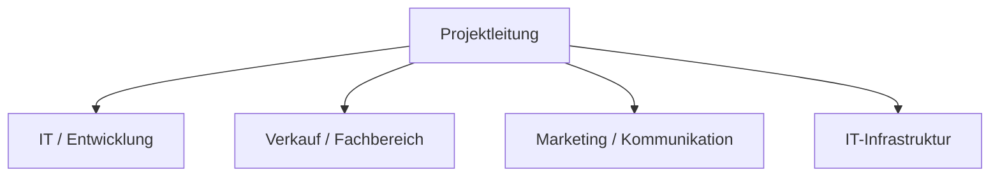
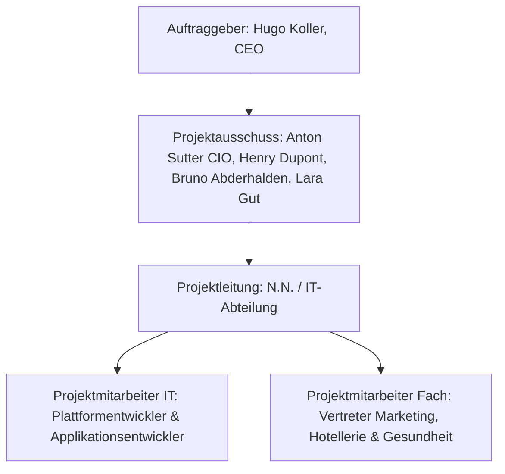

# Modul 306 - Kleinprojekte im eigenen Berufsfeld abwickeln

## Projekt Definition

- Ziel
- Zeit
- Ressourcen
- Einmaligkeit
- Komplexität

Was macht ein Projekt aus:

- Ein Projekt kreiert etwas neues
- Start- und Endatum
- Ist einmalig
- Ist nich Alltag

## 306-1A SideQuest:

### Aufgabe 1

P = Projekt, DB = Daily Business

| Nr. | Situation                                                                                                                                      |  P  | DB  | Begründung                                                                                  |
| --: | ---------------------------------------------------------------------------------------------------------------------------------------------- | :-: | :-: | ------------------------------------------------------------------------------------------- |
|  1. | Aktualisierung der Firmenhomepage mit den neusten Produkten.                                                                                   |     |  X  | Routine mässige Pflege bestehender Systeme.                                                 |
|  2. | Firmenstand an einer grossen Fachmesse im Herbst vorbereiten.                                                                                  |  X  |     | Einmaliges Ereignis mit festem Endtermin und Ziel.                                          |
|  3. | Auf vielfachen Kundenwunsch wird eine Supportplattform im Internet erstellt.                                                                   |  X  |     | Neuentwicklung eines Systems. Einmaliger Aufbau, bevor es in den Betrieb geht.              |
|  4. | Die Geschäftsleitung möchte einen Bericht über die Auslastung der IT.(Supportfälle, Störungen der Systeme, Systemdowntime, Verfügbarkeitsrate) |     |  X  | Regelmässiges Reporting und Monitoring sind Teil der betrieblichen Linienaufgaben.          |
|  5. | Im Sommer einen Abteilungsausflug mit allen IT-Mitarbeitern durchführen.                                                                       |  X  |     | Einmaliges Vorhaben mit Planung, Budget und Termincharakter (Event-Projekt).                |
|  6. | Erstellen einer Schnittstelle zwischen dem Web-Shop und der Buchhaltungssoftware.                                                              |  X  |     | Technische Neuerung/Entwicklung mit definiertem Anfang und Ende.                            |
|  7. | Für den Support sind die Prozesse gemäss ITIL zu gestalten.                                                                                    |  X  |     | Organisationsentwicklung; die Umstellung ist ein Projekt, der spätere Support ist Business. |
|  8. | Überprüfung der Produktqualität im Unternehmen.                                                                                                |     |  X  | Qualitätssicherung ist ein dauerhafter, begleitender Prozess im Unternehmen.                |
|  9. | Überprüfung der Sicherheit in den Abteilungen IT und HR.                                                                                       |  X  |     | Ein Audit oder eine spezifische Überprüfung ist meist ein zeitlich begrenzter Auftrag.      |
| 10. | Der Pausenraum in der Firma ist ziemlich veraltet und sollte erneuert werden. Es wird ein Ideenwettbewerb gestartet.                           |  X  |     | Einmalige bauliche/gestalterische Veränderung mit kreativem Prozess.                        |
| 11. | Die Firma hat sich entschieden, ihre bestehende Buchhaltungslösung durch eine neue, die eines anderen Herstellers zu ersetzten.                |  X  |     | Hohe Komplexität, Risiko und einmaliger Systemwechsel (Migration).                          |
| 12. | Patchen der Server und verschiedenen Programme.                                                                                                |     |  X  | Wiederkehrende Wartungsaufgabe zur Aufrechterhaltung des Betriebs.                          |
| 13. | Einführen eines neuen Texteditors in der IT-Abteilung.                                                                                         |  X  |     | Evaluation, Test und Rollout eines neuen Werkzeugs sind Projektschritte.                    |

### Aufgabe 2

- I = Initialisierung
- V = Voranalyse
- K = Konzept
- R = Realisierung
- T = Testen
- E = Einführung
- A = Abschluss

| Nr. | Erwartete Ergebnisse                    |  I  |  V  |  K  |  R  |  T  |  E  |  A  |
| --: | --------------------------------------- | :-: | :-: | :-: | :-: | :-: | :-: | :-: |
|  1. | Abschlussbericht                        |     |     |     |     |     |     |  X  |
|  2. | Bericht "Einführung"                    |     |     |     |     |     |  X  |     |
|  3. | Detailstudien                           |     |     |  X  |     |     |     |     |
|  4. | Einführungskonzept                      |     |     |  X  |     |     |     |     |
|  5. | Grobtermine sind bekannt                |     |  X  |     |     |     |     |     |
|  6. | Handbücher (Orga, Migration, Support)   |     |     |     |  X  |     |     |     |
|  7. | Konzeptergebnis                         |     |     |  X  |     |     |     |     |
|  8. | Lösungsvorschläge                       |     |  X  |     |     |     |     |     |
|  9. | Modultest, Kettentest, Systemtests      |     |     |     |     |  X  |     |     |
| 10. | Phasenfreigabe Abschluss                |     |     |     |     |     |     |  X  |
| 11. | Phasenfreigabe Einführung               |     |     |     |     |     |  X  |     |
| 12. | Phasenfreigabe Konzept                  |     |     |  X  |     |     |     |     |
| 13. | Phasenfreigabe Realisierung             |     |     |     |  X  |     |     |     |
| 14. | Phasenfreigabe Testen                   |     |     |     |     |  X  |     |     |
| 15. | Projektantrag                           |  X  |     |     |     |     |     |     |
| 16. | Projektauftrag                          |     |  X  |     |     |     |     |     |
| 17. | Projektleiter ist bekannt               |  X  |     |     |     |     |     |     |
| 18. | Prototypen                              |     |     |     |  X  |     |     |     |
| 19. | Situationsanalyse                       |     |  X  |     |     |     |     |     |
| 20. | Systemabnahme (Abnahmebericht)          |     |     |     |     |     |  X  |     |
| 21. | Systemanforderungen                     |     |  X  |     |     |     |     |     |
| 22. | Systemintegration                       |     |     |     |     |  X  |     |     |
| 23. | Systemspezifikationen (Anford., Design) |     |     |  X  |     |     |     |     |
| 24. | Systemziele (Problem behoben?)          |     |  X  |     |     |     |     |     |
| 25. | Testdrehbücher                          |     |     |     |  X  |     |     |     |
| 26. | Testhandbücher                          |     |     |     |  X  |     |     |     |
| 27. | Testprotokolle                          |     |     |     |     |  X  |     |     |

**Erklärungen der wichtigsten Punkte:**

- Voranalyse (V): Hier wird geklärt, ob das Projekt machbar ist. Daher entstehen hier der Projektauftrag und die Systemziele.
- Konzept (K): In dieser Phase wird der "Bauplan" erstellt. Die Detailstudien und die Spezifikationen werden hier abgeschlossen.
- Realisierung (R): Hier wird gebaut. Parallel zur Programmierung/Erstellung werden bereits die Handbücher und Testdrehbücher vorbereitet.
- Testen (T): Hier werden die Protokolle der durchgeführten Tests (Testprotokolle) sowie die Systemintegration finalisiert.
- Einführung (E): Das System geht live. Die Abnahme durch den Kunden findet hier statt.
- Abschluss (A): Das Projekt wird formal beendet, Erfahrungen werden im Abschlussbericht gesichert.

## 306-1B SideQuest:

### 1. Grundsätze zum Aufbau der Dokumentenverwaltung

Um Chaos zu vermeiden, sollte die Ablage **funktional** und **phasenorientiert** aufgebaut sein. Ich würde eine zentrale, cloudbasierte Plattform (z.B. SharePoint oder Confluence) mit folgender Ordnerstruktur wählen:

- Zentrale Ablage: Alle Dokumente liegen an einem Ort ("Single Source of Truth"). Lokale Kopien sind untersagt.
- Phasenstruktur: Die Hauptordner orientieren sich am Projektlebenszyklus (00_Initialisierung, 01_Konzept, 02_Realisierung, etc.).
- Berechtigungskonzept: Lese- und Schreibrechte werden rollenbasiert vergeben (z.B. darf nur der Projektleiter freigegebene Berichte im Ordner "Abschluss" ablegen).
- Versionierung: Dokumente werden nicht überschrieben, sondern versioniert (v0.1 für Entwürfe, v1.0 für Abnahmen), um die Historie nachvollziehbar zu machen.
- Archivierung: Veraltete Stände wandern in einen Unterordner `99_Archiv`, damit im Arbeitsverzeichnis nur aktuelle Dateien liegen.

### 2. Informationen innerhalb eines Dokuments (Metadaten)

Jedes offizielle Projektdokument muss ein Deckblatt oder einen Header enthalten, der folgende **5 Informationen** zwingend ausweist:

1. Eindeutiger Titel: Was ist der Inhalt des Dokuments? (z.B. "Projektauftrag").
2. Versionsnummer & Status: (z.B. v1.2, Status: "In Prüfung" oder "Freigegeben").
3. Autor & Verantwortlicher: Wer hat es geschrieben und wer ist für den Inhalt fachlich zuständig?
4. Erstellungs- & Änderungsdatum: Wann wurde die letzte Anpassung vorgenommen?
5. Verteiler / Klassifizierung: Wer darf das Dokument lesen? (z.B. "Intern", "Vertraulich").

### 3. Aufbau der Namenskonvention inkl. Beispiel

Eine gute Namenskonvention erlaubt es, den Inhalt einer Datei zu kennen, ohne sie öffnen zu müssen.

**Struktur:**
`[Datum_ISO]_[Projektkürzel]_[Dokumententyp]_[Kürzel_Autor]_[Version].[Endung]`

- Datum: Format YYYYMMDD (sortiert sich automatisch chronologisch).
- Projektkürzel: Ein kurzes Akronym für das Projekt (z.B. "ERP26").
- Dokumententyp: Schlagwort zum Inhalt.
- Kürzel: Initialen des Erstellers.
- Version: vX.X (wobei X.0 immer ein Meilenstein/Abschluss ist).

**Beispiel für ein Pflichtenheft:**

Nehmen wir an, das Projekt heisst "Webshop-Integration" (Kürzel: **WSI**) und Sie haben das Pflichtenheft am 31. März 2026 fertiggestellt (Version 1.0).

**Dateiname:**
`20260331_WSI_Pflichtenheft_MM_v1.0.pdf`

## HERMES

### 1. Die vier Phasen

Ein Projekt wird bei HERMES immer in einem festen Lebenszyklus durchlaufen. Jede Phase endet mit einem **Entscheid**, ob das Projekt fortgesetzt werden darf:

- **Initialisierung:** Lohnt sich das Projekt? (Erstellung des Projektauftrags).
- **Konzept:** Wie genau soll die Lösung aussehen?
- **Realisierung:** Die Lösung wird gebaut und getestet.
- **Einführung:** Das System geht live und wird in den Betrieb übergeben.

### 2. Szenarien

Da nicht jedes Projekt gleich ist, bietet HERMES verschiedene „Schablonen“ an, die sogenannten Szenarien (z. B. „IT-Individualanwendung“, „Dienstleistung/Infrastruktur“ oder „Anpassung einer Standardsoftware“). Man nutzt also nur die Module, die man wirklich braucht.

### 3. Module und Aufgaben

Die Methode unterteilt die Arbeit in thematische Blöcke (Module), wie z. B. Projektsteuerung, Beschaffung oder Organisation. Innerhalb dieser Module sind spezifische Aufgaben definiert, die zu erledigen sind.

### 4. Rollen

HERMES definiert klare Verantwortlichkeiten in drei Hierarchieebenen:

- **Steuerung:** Der Auftraggeber (trägt die Letztverantwortung).
- **Führung:** Der Projektleiter (plant und führt das Team).
- **Ausführung:** Die Fachspezialisten (erarbeiten die Ergebnisse).

### 5. Ergebnisse (Dokumente)

Für fast jede Aufgabe gibt es Dokumentvorlagen (z. B. Projektauftrag, Phasenbericht, Abnahmeprotokoll). Das sorgt dafür, dass die Dokumentation konsistent bleibt.

### Fragen von Lehrperson

1.  Welche Phasen gibt es?

HERMES 2022 (die aktuelle Version) gliedert jedes Projekt in vier einheitliche Phasen. Jede Phase endet mit einem Entscheid des Auftraggebers über die Fortführung.

- Initialisierung: Klärung der Machbarkeit, Erarbeitung des Projektauftrags und Wahl des passenden Szenarios.
- Konzept: Erarbeitung der Detailanforderungen und der Systemarchitektur (Was genau wird gebaut?).
- Realisierung: Die eigentliche Umsetzung, Programmierung oder Erstellung der Lösung inklusive Tests.
- Einführung: Vorbereitung des Betriebs, Schulung der Anwender und Abnahme des Systems.

2. Welche Rollen gibt es?

Die Rollen sind in drei Hierarchieebenen unterteilt, um die Verantwortlichkeiten klar zu trennen:

- Ebene Steuerung:
  - Auftraggeber: Die wichtigste Rolle. Er trägt die Letztverantwortung und trifft die Phasenentscheide.
- Ebene Führung:
  - Projektleiter: Verantwortlich für die Planung, Führung des Teams und das Erreichen der Projektziele (Zeit, Kosten, Qualität).
- Ebene Ausführung:
  - Anwender/Fachspezialisten: Sie bringen das Fachwissen ein und nutzen später die Lösung.
  - Ersteller/Entwickler: Sie bauen die Lösung (z.B. Software-Entwickler oder Architekten).

3. Wozu dient HERMES? (Zweck)

- Einheitlichkeit: Alle Beteiligten (Behörden, Firmen, Externe) sprechen die gleiche Sprache.
- Transparenz: Durch die Phasenentscheide ist jederzeit klar, wo das Projekt steht.
- Qualitätssicherung: Vordefinierte Checklisten und Dokumentvorlagen verhindern, dass wichtige Schritte vergessen werden.
- Risikomanagement: Probleme werden frühzeitig erkannt, da am Ende jeder Phase kritisch geprüft wird, ob sich die Weiterführung noch lohnt.

4. Was habt ihr erkannt? (Notizen für den Team-Austausch)

Hier sind Punkte, die ihr im Team besprechen könnt, um zu zeigen, dass ihr das System verstanden habt:

- Erkenntnis zu den Phasen: "Wir haben erkannt, dass HERMES durch die festen Phasen hilft, 'Wildwuchs' zu vermeiden. Man fängt nicht einfach an zu bauen, ohne dass die Initialisierung sauber abgeschlossen ist."
- Erkenntnis zu den Rollen: "Es ist entscheidend, dass der Auftraggeber klar definiert ist. Ohne einen verantwortlichen Auftraggeber auf der Steuerungsebene fehlen dem Projektleiter oft die Kompetenzen für wichtige Entscheidungen."
- Erkenntnis zum Zweck: "HERMES ist kein starres Korsett, sondern ein Werkzeugkasten. Durch die 'Szenarien' können wir die Methode auf die Grösse unseres spezifischen Projekts anpassen (Tailoring)."

**Tipp für deine Notizen:**
Erwähne kurz, dass HERMES der Standard in der öffentlichen Verwaltung der Schweiz ist. Das zeigt deinem Lehrer, dass du auch den Kontext der Anwendung verstanden hast.

## 306-2A SideQuest:

### Aufgabe 1: Ressourcenanforderung und Teamzusammenstellung

Hier ist eine Übersicht der benötigten Bereiche für das IT-Kleinprojekt (Plattform- oder Applikationsentwicklung) inklusive Begründung und Hauptaufgaben.

Bereich IT / Softwareentwicklung
Warum: Dieser Bereich stellt das technische Kernwissen für die Umsetzung.
Grosse Aufgaben: Programmierung der Applikation oder Plattform, Erstellung der Systemarchitektur, technische Umsetzung des Pflichtenhefts.

Bereich Verkauf / Fachbereich (Business)
Warum: Die Personen aus diesem Bereich kennen die Kundenbedürfnisse, die internen Prozesse und den Markt.
Grosse Aufgaben: Definition der fachlichen Anforderungen (Anforderungskatalog), Testen der Applikation aus Nutzersicht, Input für nutzerfreundliche Abläufe.

Bereich Marketing / Kommunikation
Warum: Eine neue Plattform muss den Kunden bekannt gemacht und optisch ansprechend gestaltet werden.
Grosse Aufgaben: Erstellung von Inhalten (Texte, Bilder), Design-Vorgaben (Corporate Identity), Planung der internen und externen Kommunikation zur Einführung.

Bereich IT-Infrastruktur / Systemadministration
Warum: Die neue Anwendung benötigt eine Umgebung, auf der sie sicher und stabil laufen kann.
Grosse Aufgaben: Bereitstellung von Serverkapazitäten, Einrichten von Datenbanken, Sicherstellen von Backup- und Sicherheitskonzepten.

### Aufgabe 2: Kommunikation (Ich-Botschaften)

Eine saubere Ich-Botschaft besteht aus einer wertfreien Beobachtung, dem eigenen Gefühl oder Gedanken dazu und dem eigenen Bedürfnis oder einer Erklärung.

Gespräch mit Marc (Verkauf)
Ich nehme wahr, dass du dem neuen Internet-Kanal eher skeptisch gegenüberstehst, und ich befürchte, dass du dir vielleicht Sorgen um deinen Arbeitsplatz machst. Mir ist es ein grosses Anliegen dir aufzuzeigen, dass das Internet als reine Ergänzung gedacht ist. So können wir bei gleichem Personalbestand in Zukunft einfach noch mehr Kunden bearbeiten.

Gespräch mit Sabine (IT)
Ich freue mich riesig über deine Begeisterung und schätze deine bereits recherchierten Lösungsvorschläge sehr. Da wir uns momentan aber noch ganz am Anfang in der konzeptionellen Phase befinden, befürchte ich, dass wir uns jetzt in technischen Details verlieren. Ich möchte dich bitten, diese wertvollen Ideen noch etwas zurückzuhalten, damit wir sie später in der Umsetzungsphase gezielt einsetzen können.

### Aufgabe 3: Projektrollen und Aufgaben

Hier ist die Zuweisung der Tätigkeiten zu den jeweiligen Rollen. Bei einigen Aufgaben arbeiten mehrere Rollen zusammen, wobei die Hauptverantwortung (V) oder der Entscheid (E) massgebend ist.

| Aufgaben                                                                                                                      | AG  | PA  | PL  | TPL | PM  | User |
| ----------------------------------------------------------------------------------------------------------------------------- | --- | --- | --- | --- | --- | ---- |
| Protokoll der Teilprojektsitzung erstellen                                                                                    |     |     | I   | V   | A   |      |
| Projektantrag bewilligen                                                                                                      | E,V | I   | I   |     |     |      |
| Anforderungskatalog erstellen                                                                                                 | I   |     | V   |     | A   | A    |
| Pflichtenheft schreiben                                                                                                       | I   |     | V   |     | A   | I    |
| Controlling                                                                                                                   | I   | I   | V,A |     |     |      |
| Entscheid fällen über eine kleine Änderung im Projekt (Aufbau einer Webseite)                                                 | I   |     | E,V |     | A   |      |
| Eine grosse Änderung im Projekt muss gefällt werden (Beschaffung neuer Server, da die Kapazitäten der alten nicht ausreichen) | E   | E   | A   |     |     |      |
| Die nächste Projektphase wird freigegeben                                                                                     | E,V | E   | I   |     |     |      |
| Im Risikokatalog müssen die aufgeführten Massnahmen bewilligt werden.                                                         | I   | E   | A   |     |     |      |
| In der Testphase wurden erhebliche Mängel festgestellt. Die Phase muss wiederholt werden.                                     | E   | E   | I   |     |     |      |

Tätigkeiten:

- E: Entscheiden
- V: Verantwortlich
- A: Arbeiten
- I: Informieren

Legende:

- AG (Auftraggeber)
- PA (Projekt Ausschuss)
- PL (Projektleiter)
- TPL (Teilprojektleiter)
- PM (Projektmitarbeiter)

## 306-2B SideQuest:

### 1. Teilaufgabe: Projektorganisation (Organigramm)

Für das Projekt "Einführung Gästeinformationssystem" (App und Infodisplays) wird folgende Projektorganisation vorgeschlagen.

### 2. Teilaufgabe: Rollenaufteilung im Team

Auftraggeber (AG)
Rolle besetzt durch: Hugo Koller (CEO).
Aufgaben: Gibt das Projekt und das Budget frei, fällt strategische Projektentscheide, nimmt die Projektergebnisse am Ende ab und vertritt das Projekt gegenüber externen Partnern. Er verfolgt die strategische Umsetzung der Digitalisierung.

Projektausschuss (PA)
Rolle besetzt durch: Anton Sutter (IT), Henry Dupont (Gesundheitszentrum), Bruno Abderhalden (Hotellerie), Lara Gut (Administration).
Aufgaben: Überwacht den Projektfortschritt, entscheidet über Abweichungen (Kosten, Termine, Leistung), priorisiert Anforderungen aus den verschiedenen Abteilungen und unterstützt den Projektleiter bei Eskalationen.

Projektleiter (PL)
Rolle besetzt durch: Ein designierter Mitarbeiter aus der IT-Abteilung.
Aufgaben: Führt das Projektteam, plant Termine und Ressourcen, überwacht das Budget, koordiniert die Aufgaben zwischen Applikationsentwicklung, Plattformentwicklung und den Fachbereichen. Er rapportiert regelmässig an den Projektausschuss.

Projektmitarbeiter IT (PM IT)
Rolle besetzt durch: Entwickler, IT-Supportmitarbeiter, IT-Sicherheitsexperte.
Aufgaben: Die Plattformentwickler beschaffen und installieren die Hardware (Displays, Messgeräte, Gateways). Die Applikationsentwickler programmieren die massgeschneiderte App und binden Schnittstellen (Wetter, ERP, News) an. Der IT-Sicherheitsexperte prüft die Datensicherheit.

Projektmitarbeiter Fachbereiche (PM Fach)
Rolle besetzt durch: Thierry Gschpon (Marketing), Vertreter Rezeption/Hotellerie.
Aufgaben: Das Marketing definiert das Layout, erfasst redaktionelle Artikel und touristische Angebote und gibt diese frei. Die Hotellerie definiert die Anforderungen für die direkten Buchungsmöglichkeiten in der App.

### 3. Teilaufgabe: Stakeholderanalyse

| Stakeholder                      | Interesse / Erwartung an das Projekt                                                                                                                 | Einfluss / Macht                                     | Massnahmen / Umgang                                                                                                                       |
| -------------------------------- | ---------------------------------------------------------------------------------------------------------------------------------------------------- | ---------------------------------------------------- | ----------------------------------------------------------------------------------------------------------------------------------------- |
| Hotelgäste                       | Erwarten ein einfach bedienbares System, aktuelle Informationen (Wetter, News) und reibungslose Buchungsmöglichkeiten für Angebote.                  | Gering (Endnutzer, entscheiden aber über Akzeptanz)  | Usability-Tests durchführen, intuitive Benutzeroberfläche gestalten, Datenschutz transparent kommunizieren.                               |
| Hugo Koller (CEO)                | Möchte, dass die IT-Strategie "Digitalisierung" erfolgreich umgesetzt wird und die Wettbewerbsfähigkeit des Hotels steigt.                           | Sehr Hoch (Auftraggeber, Budgetverantwortung)        | Regelmässiges Status-Reporting (Kosten, Termine, Meilensteine), aktive Einbindung bei strategischen Fragen.                               |
| Anton Sutter & IT-Abteilung      | Erwarten eine saubere Dokumentation (aufgrund früherer Ausfälle), nahtlose Integration in bestehendes Netzwerk (VLAN, Cloud) und hohe IT-Sicherheit. | Hoch (Ressourcenbereitstellung, technischer Betrieb) | Systemarchitektur frühzeitig abstimmen, IT-Sicherheitsexperte in die Planung einbeziehen, klare Betriebs- und Supportprozesse definieren. |
| Marketing (Team Thierry Gschpon) | Benötigen ein einfach zu bedienendes Backend, um News, Angebote und redaktionelle Artikel effizient zu erfassen und freizugeben.                     | Mittel                                               | Schulung im Umgang mit dem Content Management System (CMS), Einbezug bei der Definition der Eingabemasken.                                |
| Hotellerie / Rezeption           | Erwarten, dass durch das System der Gästeservice verbessert wird und direkte Buchungen über die App reibungslos in die Hotel-Lösung fliessen.        | Mittel                                               | Schulung für geänderte Prozesse bei App-Buchungen, Rückmeldungen zu Gästebedürfnissen systematisch abholen.                               |

## Notizen 2026-05-05

Magisches Dreieck: Sachen hängen miteinander zusammen und wenn man an etwas zieht, dann gibt es höhrere Kosten / niedrigere Qualität.
